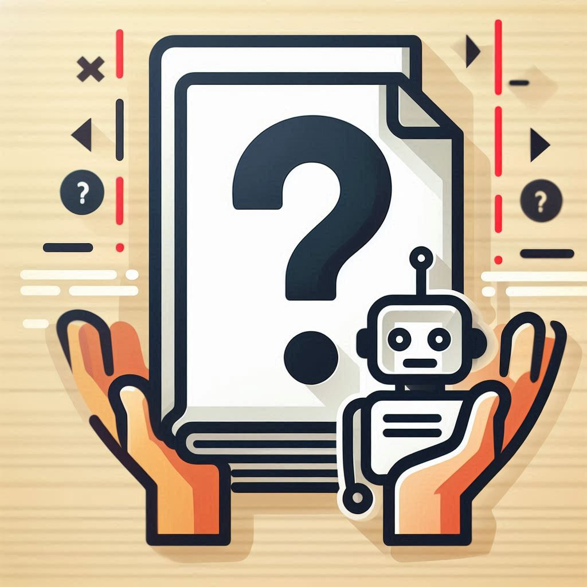

# DocuQA-Chat

This app lets you create a chatbot that can answer your questions based on information from your own documents.  Just upload your files (PDFs, Word documents, or text files), and the app will process them. Then, you can chat with the bot, and it will use the information from your uploaded documents to give you helpful and relevant answers.  It remembers the conversation history so you can have a back-and-forth dialogue with it.

Use the hosted demo:
[DocuQA-Chat Demo](https://huggingface.co/spaces/reab5555/DocuQA-Chat)

## How it works (technical details)

This application uses several libraries to achieve document-based question answering:

1. **Document Loading and Processing:**  The app uses `PyPDF2` to read PDFs, built-in Python functionalities for text and docx files, and handles potential encoding issues. It creates `langchain.Documents` which store the text content and metadata like the file source.

2. **Text Splitting:** `langchain.text_splitter.RecursiveCharacterTextSplitter` breaks down the document content into smaller chunks. This is important for efficient processing and embedding creation.

3. **Embeddings:**  The app uses `HuggingFaceEmbeddings` from the `langchain_huggingface` library.  Embeddings are numerical representations of text that capture the meaning and semantic relationships between words. It utilizes the `sentence-transformers/all-mpnet-base-v2` model, which generates high-quality embeddings.

4. **Vector Store:**  It employs `FAISS` (Facebook AI Similarity Search), a library optimized for efficient similarity search, to store and search the document embeddings. The vector store is created using the embeddings of the text chunks and saved locally for persistence.

5. **Large Language Model (LLM):**  The app integrates with the `ChatAnthropic` LLM (Claude 3.5) through the `langchain_anthropic` library. This LLM provides the reasoning and natural language generation capabilities for answering questions based on the retrieved information. The Claude API key is retrieved from the environment variable `CLAUDE_API_KEY`.

6. **Conversational Retrieval Chain:**  `ConversationalRetrievalChain` from Langchain orchestrates the question-answering process. It takes a user question, retrieves relevant document chunks from the FAISS vector store based on similarity to the question's embedding, and passes them to the LLM along with the conversation history to generate an answer.

7. **Conversation Memory:**  `ConversationBufferMemory` from Langchain stores the conversation history, allowing the chatbot to maintain context and refer back to previous exchanges.

8. **Gradio Interface:** The `gradio` library creates the user interface, allowing users to upload files, initiate processing, and interact with the chatbot. The interface includes file upload controls, a processing status output, a chat window, and buttons for sending messages and clearing the chat history.

In essence, the application creates a searchable index of your documents. When you ask a question, it converts your question into an embedding, searches for similar embeddings in the index, retrieves the corresponding text chunks, and uses the LLM to formulate an answer based on the retrieved information and the conversation history.
